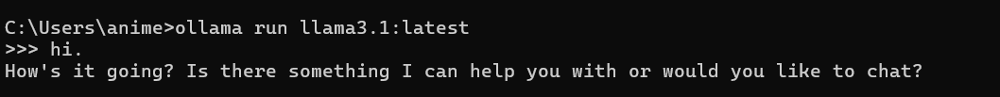

##### **Helpful Ollama commands**

* `ollama pull ...` → pulling a model to our device
* `ollama run ...` → running the pulled model
* `ollama list` → list all the available models

**Running an Ollama model:**



**Running via curl command:**

`curl -X POST http://localhost:11434/api/generate -H "Content-Type: application/json" -d "{\"model\":\"llama3\",\"prompt\":\"what is a cat?\",\"stream\":false}"`

Here:

* `localhost:11434` → Ollama's local inference server
* `/api/generate` → text generation endpoint
* `"model"` → already pulled model
* `"prompt"` → user message
* `"stream": false` → single json response (not token by token)

**Call Ollama via API (using curl):**

```
```bash
curl -X POST http://localhost:11434/api/chat ^
  -H "Content-Type: application/json" ^
 -d "{\"model\":\"llama3\",\"messages\":[{\"role\":\"system\",\"content\":\"You are a helpful assistant.\"},{\"role\":\"user\",\"content\":\"What does a cat eat?\"}],\"options\":{\"temperature\":0.7,\"num_predict\":100},\"stream\":false}" 
```

Output:

[JSON output](D:\Animesh\Projects\llm-learning\day01\output.json "View the output")

**Now we will check this by just adjusting the temperature.**

* temperature = `0.1`

[JSON Output for temp = 0.1](D:\Animesh\Projects\llm-learning\day01\temp0.1.json)

* temperature = `0.9`

[JSON Output for temp = 0.9](D:\Animesh\Projects\llm-learning\day01\temp0.9.json "view")

**Metadata Revealing:**

* `"model" `→` the name of the model that has been invoked`
* `"created_at"`→` UTC timestamp when the response was generated`
* `"message"` → `"role"` is always assistant and `"content"` is the generated text.
* `"done"` → `true` if model stopped. `false` → if stream still going on
* `"done_reason"` → `"stop"` if model decided to stop naturally, `"length"` if token limit hit, and `"error"` if something broke.
* `"total_duration"` → total time in nanoseconds
* `"load_duration"` → total time to load the model in nanoseconds
* `"prompt_eval_count"` → Number of input tokens processed, including system prompt, user prompt and conversation history.
* `"prompt_eval_duration"` → Time spent processing prompt in nanoseconds
* `"eval_count"` → Number of output tokens generated, this should be close to `num_predict`
* `"eval_duration"` → Time spent generating output tokens in nanoeconds
*
