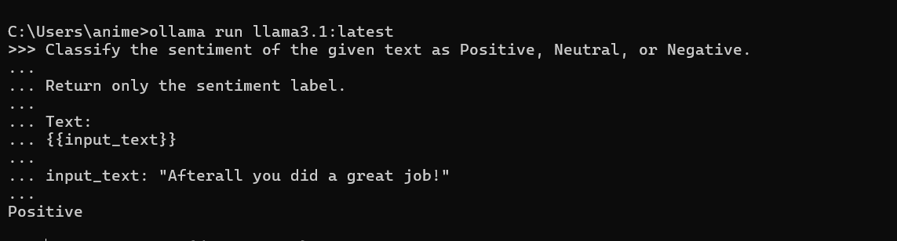

The improved prompt:

```
Classify the sentiment of the given text as Positive, Neutral, or Negative.

Return only the sentiment label.

Text:
{{input_text}}

input_text: "Afterall you did a great job!"
```

[Improved Prompt Output](D:\Animesh\Projects\llm-learning\day03\output_v2.txt "click")


